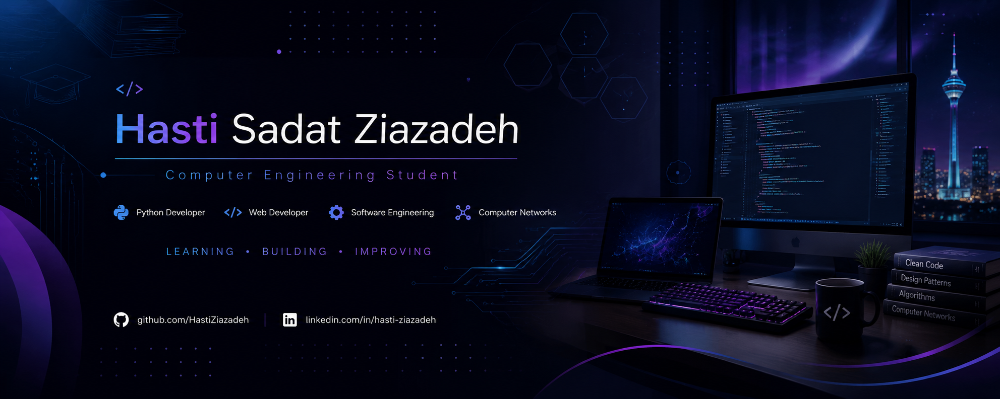

  

  

<h1 align="center">Hi 👋 I'm Hasti Sadat Ziazadeh</h1>

<h3 align="center">
Computer Engineering Student • Python Developer • Web Developer
</h3>

Passionate about Software Development, Web Technologies, Computer Networks, and Open Source.

---

# 👩‍💻 About Me

🎓 Computer Engineering undergraduate at **Islamic Azad University, Science & Research Branch** with a **GPA of 19.55 / 20**.

💻 Passionate about **Python Development, Web Development, Software Engineering, Databases, and Computer Networks**.

🚀 I enjoy building practical software projects and continuously improving my skills through academic work, programming competitions, and real-world development.

📚 Currently serving as **Editorial Manager** of the Computer Engineering Scientific Association while expanding my GitHub portfolio.

---

# 🌟 Leadership & Community

## 📖 Belle's Book Club

**Founder • Owner • Administrator**

- Founded and managed an educational book community.
- Built a Telegram community with **5,000+ subscribers**.
- Managed an Instagram page with **300+ posts**, **350+ followers**, and **17.5K+ monthly views**.
- Responsible for branding, content strategy, and community management.

---

## 💻 AetherCore

**Founder • Owner • Administrator**

- Founded and manage a technology-focused Telegram community.
- Share educational content about **Programming, AI, Cybersecurity, Software Engineering, and Emerging Technologies**.
- Built a community of **500+ members**.
- Responsible for content planning, branding, technical discussions, and community growth.

---

# 💻 Tech Stack

---

# 🚀 Featured Projects

- 🏎 Formula 1 Multi-Page Website
- 🎨 Van Gogh Biography Website
- 🧶 Persian Carpet Website
- 🍔 Restaurant Menu Website
- 🐍 Python Projects
- 📚 University Projects

---

# 📈 GitHub Statistics

---

# 🔥 GitHub Streak

---

# 🏆 GitHub Trophies

---

# 🌐 Connect With Me

&nbsp;&nbsp;&nbsp;

&nbsp;&nbsp;&nbsp;

---

